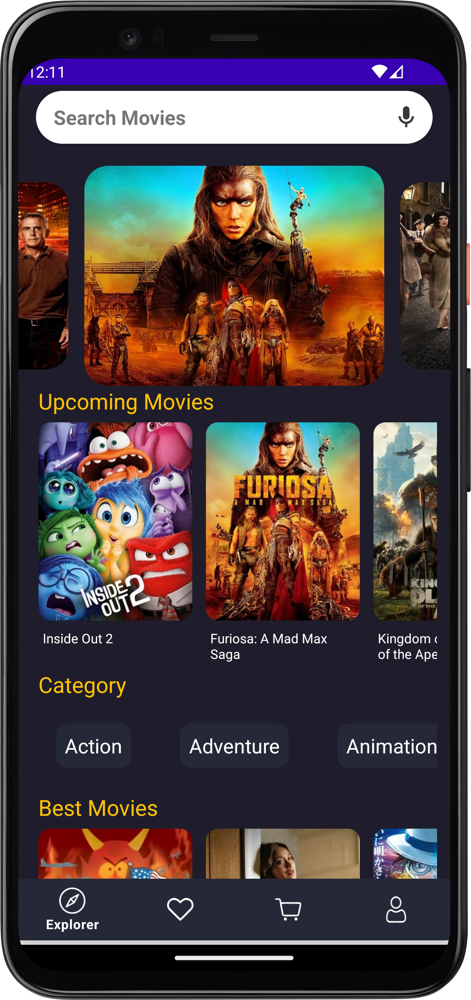

# Movie App

This application allows you to explore a vast collection of movies, powered by the TMDb API. You can view movie details, watch trailers, and more.


## Features

- Firebase Authentication: You can log in using Firebase
- Authentication: Default credentials are:
	- ## Email: admin
	- ## Password: admin
			
- TMDb API Integration: Fetches data about best movies, upcoming movies, and categories.
- Movie Details: Clicking on a movie provides detailed information including overview, IMDb rating, popularity, etc.
- Watch Trailers: Directly watch trailers from YouTube with a single tap.


## Demo


## Screenshots

  

## API Reference

#### Get all items

```http
  GET /api/items     
```

| Parameter | Type     | Description                |
| :-------- | :------- | :------------------------- |
| `api_key` | `string` | **Required**. Your API key |

#### Get item

```http
  GET /api/items/${id}
```

| Parameter | Type  | Description                       |
| :-------- | :---- | :-------------------------------- |
| `id`      | `int` | **Required**. Id of item to fetch |

#### Tmbd Api endpoints
Get Upcoming Movies
 https://api.themoviedb.org/3/movie/upcoming?api\_key=your\_api\_key

Get Genres List
 https://api.themoviedb.org/3/genre/movie/list?api\_key=your\_api\_key

Get Popular Movies
 https://api.themoviedb.org/3/movie/popular?api\_key=your\_api\_key

Get Youtube video key (it is required to play trailer)
GET https://api.themoviedb.org/3/movie/{movie\_id}/videos

Url to play trailer
https://www.youtube.com/watch?v="youtube\_key"

Get Images of Movies
GET https://api.themoviedb.org/3/movie/{movie_id}/images


## Contributing

Contributions are welcome! If you'd like to contribute to this project, please follow these steps:

1. Fork the repository.
2. Create a new branch (`git checkout -b feature/improvement`).
3. Make your changes.
4. Commit your changes (`git commit -am 'Add new feature'`).
5. Push to the branch (`git push origin feature/improvement`).
6. Create a new Pull Request.


